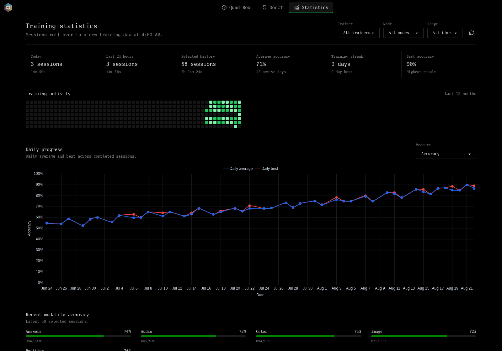

# 🧠 Cognitive Suite

Cognitive Suite combines Quad Box nback, DocCT, and Syllogimous relational reasoning training in one web app and desktop executable! These are mindbuilding exercises that can improve working memory, executive functioning, and fluid intelligence. Don't believe me? Check out some of the anecdotes on the mindbuilding discord server at https://discord.gg/brain

If you want to try it out online:

[https://oatzs.github.io/cognitive-suite/](https://oatzs.github.io/cognitive-suite/)

## QOL Improvements:

- Simple navigation between Quad Box, DocCT, Syllogimous, and a shared Statistics page.
- A combined history view for all three trainers, with filters for trainer, mode, and date range.
- Separate progress charts for Dual, Quad, Custom, DocCT, and Syllogimous modes, with only the measures that make sense for each trainer.
- Daily session counts alongside training time, a 12-month activity heatmap, streak tracking, best scores, recent sessions, and per-modality accuracy. Training days roll over at 4:00 AM, so late-night sessions stay together.
- JSON backup and restore for moving completed sessions between devices. Imports merge histories and skip duplicates instead of overwriting existing data. This means you can combine your training data from multiple devices onto one and get a full picture of your long term training data!
- CSV exports if needed.
- Offline desktop builds for Windows, macOS, and Linux.
- Safer active sessions: settings and mode switching are locked once training starts, session settings stay fixed until the run ends, and repeated stop or navigation events cannot save the same session twice.
- A full local-data reset that clears history, high scores, and settings from both trainers together.

Check out the mindbuilding discord, a great resource: https://discord.gg/brain

Thank you to the original contributors. Check them out here. 

**QuadBox:** 

https://quad-box.netlify.app.

https://github.com/soamsy/quad-box

**CCT:** 

https://docct-cn5.pages.dev/

https://github.com/SafEight/docct

**Syllogimous:**

https://soamsy.github.io/Syllogimous-v3/

https://github.com/soamsy/Syllogimous-v3

## Progress tracking



_Statistics are shown with example training data. Unfortunately, mindbuilding progress is rarely this straightforward!_


## Downloads

[Download the latest Cognitive Suite release](https://github.com/oatzs/cognitive-suite/releases/latest).
Node.js and npm are not required to use these downloads. Yes, this project is compiled javaslop 😭

- **Windows x64:** download the portable `.exe` and run it directly.
- **macOS Apple Silicon:** download the `arm64.dmg`, open it, and drag the app to Applications.
- **macOS Intel:** download the `x64.dmg`, open it, and drag the app to Applications.
- **Linux x64:** download the `.AppImage`, mark it executable, and run it.

Windows and macOS builds are currently unsigned, so the operating system may
show a security warning on first launch.

## Move training history between devices

1. On the source device, open **Statistics** and select **Export JSON**.
2. Move `cognitive-suite-backup.json` to the destination device.
3. On the destination device, open **Statistics**, select **Import JSON**, and
   choose the backup file.

Imports are additive: sessions from both devices are merged, duplicates are
skipped, and malformed or conflicting backups make no changes. The JSON backup
contains completed Quad Box and DocCT sessions plus completed timed Syllogimous
runs. It does not contain application settings, Syllogimous profiles, or the
game's full per-question history.
Treat backup files as private training data.

## Build from source (if you care)

Desktop packaging uses Electron and Electron Builder. Release builds require
Node.js 22.12 or newer.

```
npm ci
npm run desktop:package
```

Artifacts are written to `release/`:

- Windows: portable `.exe`
- macOS: `.dmg`
- Linux: `.AppImage`

Native artifacts must be built on their matching operating system. The
`desktop-release.yml` workflow builds all supported platforms when run
manually or when a `v*` tag is pushed.

## License

Original contributions to Cognitive Suite are released under the Unlicense.
The incorporated Quad Box and DocCT code remains subject to their MIT licenses.
Syllogimous remains subject to CC BY-NC 3.0 and may not be used commercially
without separate permission. See [THIRD_PARTY_NOTICES.md](THIRD_PARTY_NOTICES.md).
